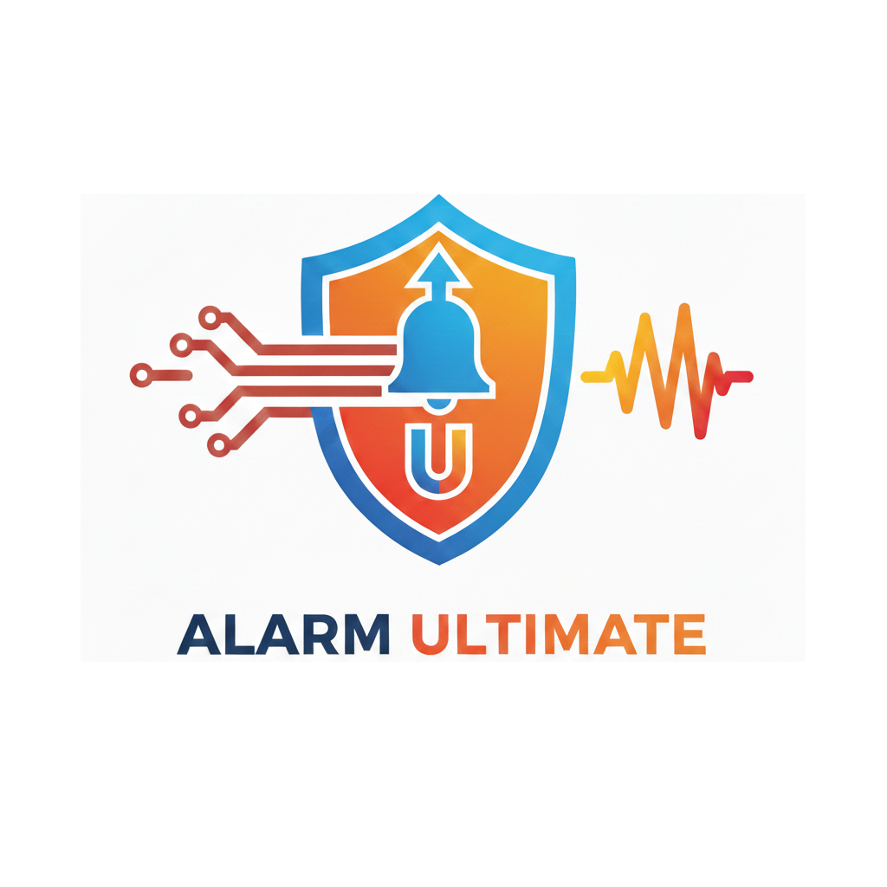

<p align="center">
  
</p>

[![NPM version][npm-version-image]][npm-url]
[![NPM downloads][npm-downloads-image]][npm-url]
[![Node-RED Flows][flows-image]][flows-url]
[![License][license-image]][license-url]
[![GitHub issues][issues-image]][issues-url]
[![Status: beta][beta-image]][repo-url]

# node-red-contrib-alarm-ultimate

Alarm System Ultimate nodes + web panel for Node-RED.

<p align="center">
  <a href="https://youtu.be/HUPzhVgObBE">
    
  </a>
  <br>
  <a href="https://youtu.be/HUPzhVgObBE">Watch the video on YouTube</a>
</p>

Includes:

- `AlarmSystemUltimate` (BETA): full alarm control panel node (zones, entry/exit delays, bypass, chime, 24h/fire/tamper, siren, event log, optional per-zone sensor supervision).
- `AlarmUltimateInputAdapter`: translates incoming messages into zone messages for `AlarmSystemUltimate` using built-in or user-defined presets.
- `AlarmUltimateOutputAdapter`: transforms alarm output/event messages to external systems (HomeKit, MQTT, ...), using built-in or user-defined presets.
- Output-only helper nodes: `AlarmUltimateState`, `AlarmUltimateZone`, `AlarmUltimateSiren`.
- Web tools: Zones JSON mapper + web Alarm Panel (embeddable in Node-RED Dashboard).

Note: `AlarmSystemUltimate` is currently **BETA**.

## Table of contents

- [Install](#install)
- [Quick start](#quick-start)
- [Screenshots](#screenshots)
- [Nodes](#nodes)
- [Web tools](#web-tools)
- [Examples](#examples)
- [Permissions and endpoints](#permissions-and-endpoints)
- [Development](#development)

## Install

- Palette Manager: Menu → **Manage palette** → **Install** → search `alarm ultimate`
- NPM:

```bash
npm i node-red-contrib-alarm-ultimate
```

## Quick start

Beginner-friendly flow:

1. Add an **AlarmSystemUltimate (BETA)** node.
2. Click **Manage zones** and add at least one zone (example topic: `sensor/frontdoor`). Use **Export JSON** / **Import JSON** in the Zones tab to backup/restore your zones.
3. Send sensor messages to the Alarm node:
   - open: `msg.topic="sensor/frontdoor"`, `msg.payload=true`
   - close: `msg.topic="sensor/frontdoor"`, `msg.payload=false`
4. Arm/disarm by sending a control message to the Alarm node:
   - `msg.topic = controlTopic` (default `alarm`)
   - `msg.command = "arm"` or `msg.command = "disarm"`
5. Connect a **Debug** node to the Alarm output to see events.

Optional (recommended):

- Use **AlarmUltimateInputAdapter** before the Alarm when your source payloads are not already boolean (KNX, HomeKit, ...).
- Use one or more **AlarmUltimateOutputAdapter** nodes to split/filter/transform the single Alarm output to integrations (HomeKit, MQTT, ...).

## Screenshots

### Alarm Panel (web)

<p align="center">
  
</p>

### Flow overview

<p align="center">
  
</p>

## Nodes

### Alarm System Ultimate (BETA)

Main node that:

- Receives **control commands** on `msg.topic === controlTopic`
- Receives **sensor messages** on any other topic and matches them to a configured zone

It emits events and state updates on a **single output** (see the node help in the editor for full details).

Use one or more `AlarmUltimateOutputAdapter` nodes to fan-out/massage events for your integrations.

Open zones listing features:

- **Open Zones (Arming)**: optional listing during exit delay
- **Open Zones (On Request)**: list open zones when a message arrives on `openZonesRequestTopic`
- **Open Zones (Cycle)**: optional always-on cyclic listing at a fixed interval (any alarm state)

#### Optional per-zone sensor supervision

You can enable **sensor supervision** per zone to detect devices that stop reporting.

- Supervision starts **immediately** when the node runs.
- If a zone does not receive a **valid** sensor update for `timeoutSeconds`, the node emits `supervision_lost` and the Alarm Panel shows `… • MISSING`.
- The next valid sensor update emits `supervision_restored`.
- If `blockArm: true` and **Block arm on violations** is enabled, arming is blocked while the zone is missing.

“Valid” means the message value can be converted to boolean using the Alarm node **With Input** property (default `msg.payload`), e.g. `true/false`, `open/closed`, `on/off`, `1/0`.

Example zone:

```json
{
  "id": "frontdoor",
  "name": "Front door",
  "topic": "sensor/frontdoor",
  "type": "perimeter",
  "supervision": { "enabled": true, "timeoutSeconds": 120, "blockArm": true }
}
```

### Output-only helper nodes

These nodes have no input and emit the current Alarm state (and changes) for one configured `AlarmSystemUltimate`:

- `Alarm State` (`AlarmUltimateState`): `msg.payload = "armed"|"disarmed"`
- `Alarm Zone` (`AlarmUltimateZone`): `msg.payload = true|false` for a selected zone
- `Alarm Siren` (`AlarmUltimateSiren`): `msg.payload = true|false` when the siren is on/off

### Input Adapter

`AlarmUltimateInputAdapter` translates incoming messages (from arbitrary sources) into the format expected by the Alarm zones.

- Built-in presets are shipped with the package.
- A single user preset (custom JavaScript) can be created/edited inside the node and is stored in the node configuration.
- You can optionally select an **Alarm node** to let presets reuse its **Control topic** (useful for integrations like HomeKit).

Built-in preset note:

- **Apple HomeKit Security System**: converts HomeKit state messages (e.g. `payload.SecuritySystemTargetState` 0..3) into `msg.command` (`arm_home` / `arm_away` / `arm_night` / `disarm`). To control the Alarm node, ensure the outgoing `msg.topic` equals the Alarm **Control topic**:
  - easiest: select the Alarm node in the Input Adapter (it injects `msg.controlTopic` automatically)
  - or: pass `msg.controlTopic` in your incoming messages

### Output Adapter

`AlarmUltimateOutputAdapter` transforms messages coming from a selected Alarm node using presets (no wiring from the Alarm node is required).

Example use-cases:

- Publish to MQTT topics (event/state).
- Map arming state to HomeKit Security System.
- Format “open zones” listings for dashboards / TTS.

Tip: the built-in preset list also includes stream/filter presets that correspond to the former Alarm output groups (siren, zone activity, errors, open zones, ...), plus a dedicated `Open Zones (Cycle)` stream for the always-on open-zones cycling feature.

HomeKit note:

- HomeKit expects **TargetState** to change immediately, while **CurrentState** can stay on the previous state during `arming` (exit delay).

## Web tools

These pages are served via the Node-RED admin HTTP endpoint:

- Zones JSON Mapper: `/alarm-ultimate/alarm-json-mapper`
- Alarm Panel: `/alarm-ultimate/alarm-panel`

The Alarm Panel supports:

- Preselect node: `/alarm-ultimate/alarm-panel?id=<alarmNodeId>`
- Embed mode (for Dashboard iframes): `/alarm-ultimate/alarm-panel?embed=1&id=<alarmNodeId>`
- Views: `view=keypad`, `view=zones`, `view=log` (e.g. `/alarm-ultimate/alarm-panel?embed=1&view=log&id=<alarmNodeId>`)

The Zones JSON Mapper supports:

- Sample message mapping (e.g. KNX Ultimate): map `topic`/`payload` fields and generate a zone template.
- ETS Group Addresses export (TSV): paste the exported table and generate zones in batch (boolean datapoints only).

## Examples

- `examples/alarm-ultimate-basic.json`: ready-to-import flow with `AlarmSystemUltimate`, injects and debug nodes.
- `examples/alarm-ultimate-dashboard.json`: Node-RED Dashboard example embedding the Alarm Panel in a `ui_template` iframe.
- `examples/alarm-ultimate-dashboard-controls.json`: Node-RED Dashboard example with the embedded panel plus command buttons (and a small sensor simulator).
- `examples/alarm-ultimate-dashboard-v2.json`: Dashboard 2.0 example for `@flowfuse/node-red-dashboard` (Alarm Panel + basic controls + status).
- `examples/alarm-ultimate-home-assistant-alarm-panel.json`: Home Assistant Add-on example (no MQTT) using the HA Alarm Panel card + `AlarmUltimateInputAdapter`.

See `examples/README.md`.

## Development

Run tests:

```bash
npm test
```

## Permissions and endpoints

When Node-RED authentication is enabled, the admin endpoints use these permissions (if available):

- `AlarmSystemUltimate.read`
- `AlarmSystemUltimate.write`
- `AlarmUltimateInputAdapter.read`
- `AlarmUltimateOutputAdapter.read`

HTTP admin endpoints:

- `GET /alarm-ultimate/alarm/nodes`
- `GET /alarm-ultimate/alarm/:id/state`
- `GET /alarm-ultimate/alarm/:id/log`
- `GET /alarm-ultimate/input-adapter/presets`
- `GET /alarm-ultimate/output-adapter/presets`
- `POST /alarm-ultimate/alarm/:id/command`
- `GET /alarm-ultimate/alarm-json-mapper`
- `GET /alarm-ultimate/alarm-panel`

<!-- Badges (reference-style links) -->

[repo-url]: https://github.com/Supergiovane/node-red-contrib-alarm-ultimate
[npm-url]: https://www.npmjs.com/package/node-red-contrib-alarm-ultimate
[flows-url]: https://flows.nodered.org/node/node-red-contrib-alarm-ultimate
[license-url]: LICENSE
[issues-url]: https://github.com/Supergiovane/node-red-contrib-alarm-ultimate/issues
[npm-version-image]: https://img.shields.io/npm/v/node-red-contrib-alarm-ultimate.svg
[npm-downloads-image]: https://img.shields.io/npm/dm/node-red-contrib-alarm-ultimate.svg
[flows-image]: https://img.shields.io/badge/Node--RED%20Flows-library-8f0000?logo=nodered&logoColor=white
[license-image]: https://img.shields.io/npm/l/node-red-contrib-alarm-ultimate.svg
[issues-image]: https://img.shields.io/github/issues/Supergiovane/node-red-contrib-alarm-ultimate.svg
[beta-image]: https://img.shields.io/badge/status-beta-orange.svg
