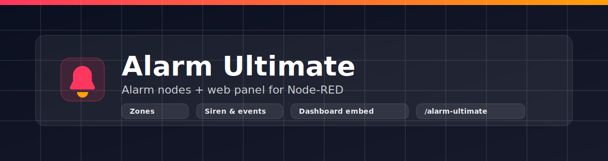
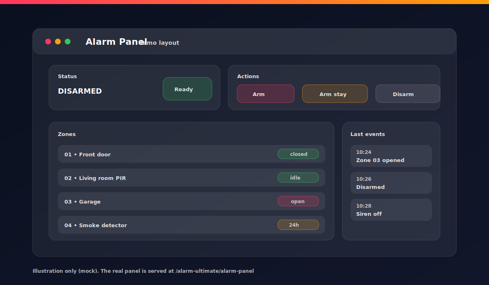
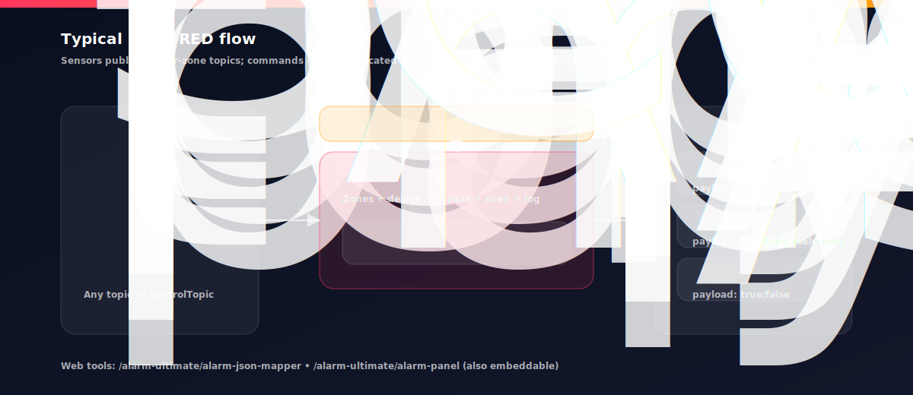

<p align="center">
  
</p>

[![NPM version][npm-version-image]][npm-url]
[![NPM downloads][npm-downloads-image]][npm-url]
[![Node-RED Flows][flows-image]][flows-url]
[![License][license-image]][license-url]
[![GitHub issues][issues-image]][issues-url]
[![Status: beta][beta-image]][repo-url]

# node-red-contrib-alarm-ultimate

Alarm System Ultimate nodes + web panel for Node-RED.

Include:

- `AlarmSystemUltimate` (BETA): full alarm control panel node (zones, entry/exit delays, bypass, chime, 24h/fire/tamper, siren, event log).
- Output-only helper nodes: `AlarmUltimateState`, `AlarmUltimateZone`, `AlarmUltimateSiren`.
- Web tools: Zones JSON mapper + web Alarm Panel (embeddable in Node-RED Dashboard).

Nota: al momento `AlarmSystemUltimate` è in **BETA**.

## Table of contents

- [Installazione / Install](#installazione--install)
- [Screenshots](#screenshots)
- [Nodes](#nodes)
- [Web tools](#web-tools)
- [Examples](#examples)
- [Permissions and endpoints](#permissions-and-endpoints)
- [Development](#development)

## Installazione / Install

- Palette Manager: Menu → **Manage palette** → **Install** → cerca `alarm ultimate`
- NPM:

```bash
npm i node-red-contrib-alarm-ultimate
```

## Screenshots

### Alarm Panel (web)

<p align="center">
  
</p>

### Flow overview

<p align="center">
  
</p>

## Nodes

### Alarm System Ultimate (BETA)

Main node that:

- Receives **control commands** on `msg.topic === controlTopic`
- Receives **sensor messages** on any other topic and matches them to a configured zone

It emits events and state updates on multiple outputs (see the node help in the editor for full details).

### Output-only helper nodes

These nodes have no input and emit the current Alarm state (and changes) for one configured `AlarmSystemUltimate`:

- `Alarm State` (`AlarmUltimateState`): `msg.payload = "armed"|"disarmed"`
- `Alarm Zone` (`AlarmUltimateZone`): `msg.payload = true|false` for a selected zone
- `Alarm Siren` (`AlarmUltimateSiren`): `msg.payload = true|false` when the siren is on/off

## Web tools

These pages are served via the Node-RED admin HTTP endpoint:

- Zones JSON Mapper: `/alarm-ultimate/alarm-json-mapper`
- Alarm Panel: `/alarm-ultimate/alarm-panel`

The Alarm Panel supports:

- Preselect node: `/alarm-ultimate/alarm-panel?id=<alarmNodeId>`
- Embed mode (for Dashboard iframes): `/alarm-ultimate/alarm-panel?embed=1&id=<alarmNodeId>`

## Examples

- `examples/alarm-ultimate-basic.json`: ready-to-import flow with `AlarmSystemUltimate`, injects and debug nodes.
- `examples/alarm-ultimate-dashboard.json`: Node-RED Dashboard example embedding the Alarm Panel in a `ui_template` iframe.

See `examples/README.md`.

## Permissions and endpoints

When Node-RED authentication is enabled, the admin endpoints use these permissions (if available):

- `AlarmSystemUltimate.read`
- `AlarmSystemUltimate.write`

HTTP admin endpoints:

- `GET /alarm-ultimate/alarm/nodes`
- `GET /alarm-ultimate/alarm/:id/state`
- `POST /alarm-ultimate/alarm/:id/command`
- `GET /alarm-ultimate/alarm-json-mapper`
- `GET /alarm-ultimate/alarm-panel`

## Development

Run tests:

```bash
npm test
```

<!-- Badges (reference-style links) -->
[repo-url]: https://github.com/Supergiovane/node-red-contrib-alarm-ultimate
[npm-url]: https://www.npmjs.com/package/node-red-contrib-alarm-ultimate
[flows-url]: https://flows.nodered.org/node/node-red-contrib-alarm-ultimate
[license-url]: LICENSE
[issues-url]: https://github.com/Supergiovane/node-red-contrib-alarm-ultimate/issues

[npm-version-image]: https://img.shields.io/npm/v/node-red-contrib-alarm-ultimate.svg
[npm-downloads-image]: https://img.shields.io/npm/dm/node-red-contrib-alarm-ultimate.svg
[flows-image]: https://img.shields.io/badge/Node--RED%20Flows-library-8f0000?logo=nodered&logoColor=white
[license-image]: https://img.shields.io/npm/l/node-red-contrib-alarm-ultimate.svg
[issues-image]: https://img.shields.io/github/issues/Supergiovane/node-red-contrib-alarm-ultimate.svg
[beta-image]: https://img.shields.io/badge/status-beta-orange.svg
