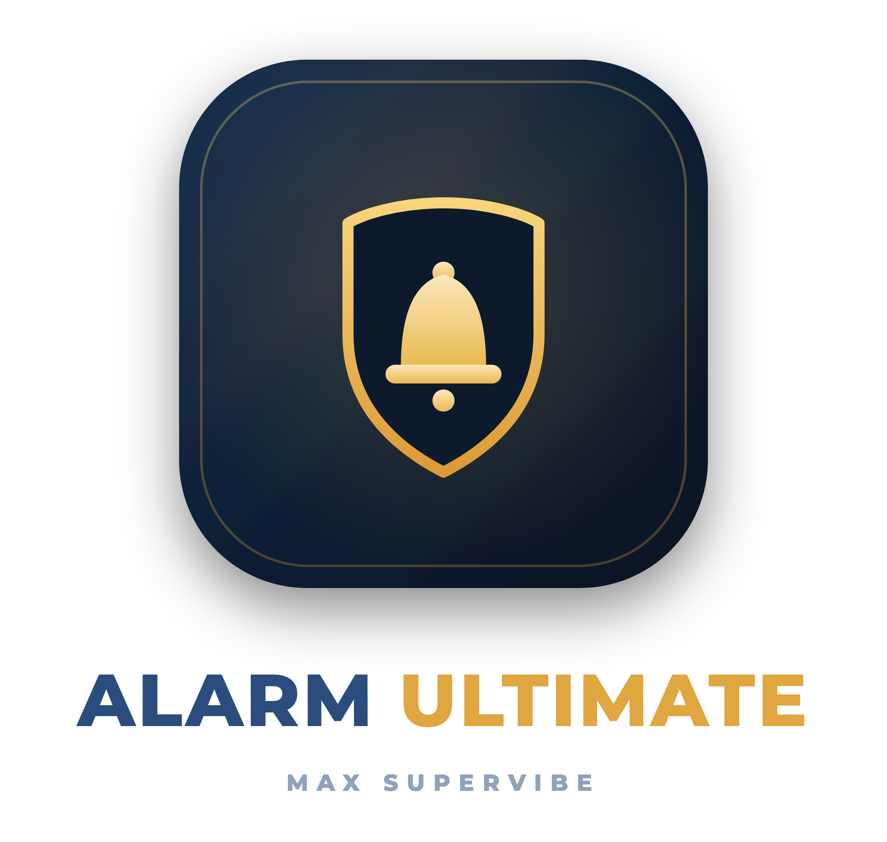
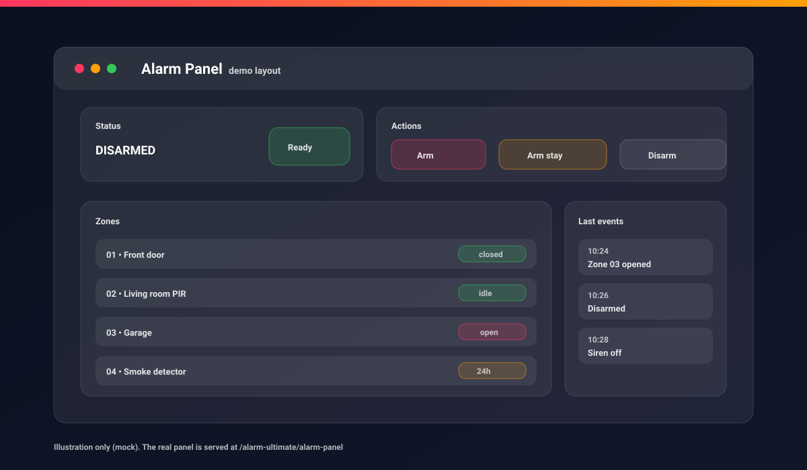

  

## A complete **alarm system** for Node-RED, with a ready-to-use **web control panel**.

Create zones, arm/disarm with optional code, entry/exit delays, bypass, chime, panic, siren, 24h/fire/tamper zones and an event log — all configured from a friendly editor, no programming required.
 
 
 

[![NPM version][npm-version-image]][npm-url]
[![NPM downloads][npm-downloads-image]][npm-url]
[![Node-RED Flows][flows-image]][flows-url]
[![License][license-image]][license-url]
[![GitHub issues][issues-image]][issues-url]

  <a href="https://youtube.com/playlist?list=PL9Yh1bjbLAYrybBZKykfKLDrRAspj9to4&si=j0mLqVMBcHKjBpNY">▶ Watch the Alarm Ultimate video playlist on YouTube</a>

### Works great with

  
  &nbsp;&nbsp;&nbsp;
  

Built‑in **Home Assistant** and **MQTT** support: the alarm can appear in Home Assistant automatically (alarm panel + a sensor per zone) without writing any configuration. See [Home Assistant & MQTT](#home-assistant--mqtt).

## Table of contents

- [Install](#install)
- [Quick start](#quick-start)
- [The web Alarm Panel](#the-web-alarm-panel)
- [Home Assistant & MQTT](#home-assistant--mqtt)
- [Zones](#zones)
- [Examples](#examples)
- [Help & support](#help--support)
- [Changelog](CHANGELOG.MD)

## Install

In Node-RED: **Menu → Manage palette → Install**, then search for **`alarm ultimate`** and click install.

That's it — the alarm nodes and the web panel are now available.

## Quick start

1. Drag an **Alarm System** node into your flow.
2. Double‑click it, click **Manage zones**, and add at least one zone (give it a name and a topic, e.g. `sensor/frontdoor`). Click **Done**.
3. Click **Deploy** (top right).
4. Open the **web Alarm Panel** to arm/disarm and see the status (see below).

To make the alarm react to your real sensors, send each sensor's state to the Alarm node:

- door/window opened → message with `topic = sensor/frontdoor` and `payload = true` (also accepts `open`, `on`, `1`)
- closed → same topic with `payload = false` (also `closed`, `off`, `0`)

> Using **Home Assistant**, **MQTT** or **KNX**? You usually don't need to build this by hand — see the sections and examples below.

## The web Alarm Panel

A full keypad‑style panel is included and opens right from your browser:

- **Alarm Panel:** `http://<your-node-red>/alarm-ultimate/alarm-panel`
- **Zones helper (visual zone editor):** `http://<your-node-red>/alarm-ultimate/alarm-json-mapper`

From the panel you can arm/disarm (with code if enabled), bypass zones, trigger panic, and read the event log. It can also be embedded in the **Node-RED Dashboard** — see the ready‑made flows in [Examples](#examples).

  

## Home Assistant & MQTT

Open the Alarm node and go to the **MQTT / HA** tab:

1. Tick **Enable MQTT** and select (or create) an **Alarm MQTT broker** configuration with your **Broker URL** (e.g. `mqtt://192.168.1.10:1883`) and, if needed, username/password.
2. Leave **HA discovery** and **Publish zones** enabled.
3. **Deploy.**

Your alarm now appears automatically in Home Assistant (same MQTT broker) as an **Alarm panel** entity, with **one sensor per zone**, all grouped under a single device. Arm/disarm from Home Assistant and the state stays in sync both ways.

Have more than one Alarm node? Point them all at the same broker configuration: they share a **single MQTT connection**, and you enter the broker settings only once.

Prefer to wire it yourself, or already use the Home Assistant Add‑on? There are ready‑to‑import example flows for both — see [Examples](#examples).

## Zones

Each zone is a sensor the alarm watches. From **Manage zones** you can set, per zone:

- **Type:** perimeter, motion, 24h, fire or tamper (24h/fire/tamper always trigger, even when disarmed).
- **Entry zone:** starts the entry countdown instead of triggering immediately.
- **Bypassable / Chime** and more.
- **Sensor supervision (optional):** if a sensor stops reporting for a while, the panel shows it as `MISSING` and can block arming — useful to catch dead batteries.

Zones can be exported/imported for backup from the **Settings** page, and there is a visual **Zones helper** to build them from a sample message (e.g. KNX) or an ETS group‑address list.

## Examples

Import any of these from **Menu → Import** (or see [`examples/`](examples/)):

- **`alarm-ultimate-basic.json`** — a minimal working flow to try it out.
- **`alarm-ultimate-mqtt.json`** — connect the alarm to an MQTT broker.
- **`alarm-ultimate-home-assistant-alarm-panel.json`** — use it with the Home Assistant Add‑on and the HA Alarm Panel card.
- **`alarm-ultimate-dashboard.json` / `-controls.json` / `-v2.json`** — embed the panel in the Node-RED Dashboard.

## Help & support

- Questions or bug reports: [open an issue][issues-url].
- Release notes: [Changelog](CHANGELOG.MD).

<!-- Badges (reference-style links) -->

[repo-url]: https://github.com/Supergiovane/node-red-contrib-alarm-ultimate
[npm-url]: https://www.npmjs.com/package/node-red-contrib-alarm-ultimate
[flows-url]: https://flows.nodered.org/node/node-red-contrib-alarm-ultimate
[license-url]: LICENSE
[issues-url]: https://github.com/Supergiovane/node-red-contrib-alarm-ultimate/issues
[npm-version-image]: https://img.shields.io/npm/v/node-red-contrib-alarm-ultimate.svg
[npm-downloads-image]: https://img.shields.io/npm/dm/node-red-contrib-alarm-ultimate.svg
[flows-image]: https://img.shields.io/badge/Node--RED%20Flows-library-8f0000?logo=nodered&logoColor=white
[license-image]: https://img.shields.io/npm/l/node-red-contrib-alarm-ultimate.svg
[issues-image]: https://img.shields.io/github/issues/Supergiovane/node-red-contrib-alarm-ultimate.svg
